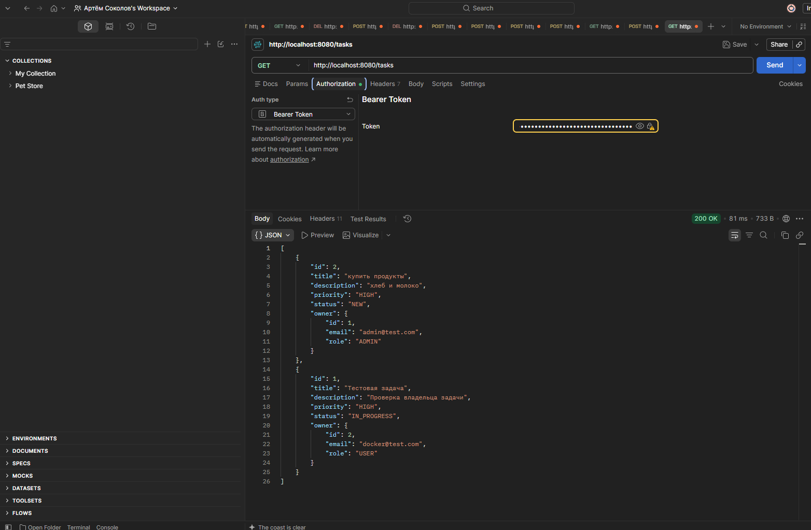
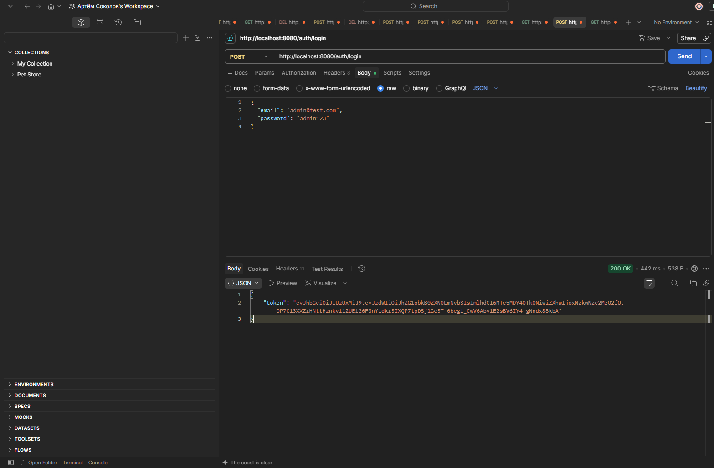
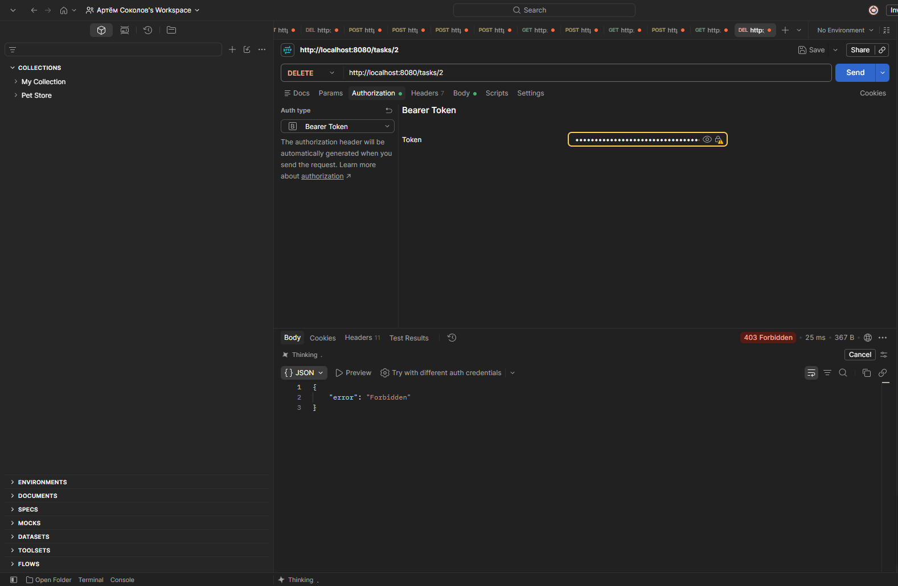
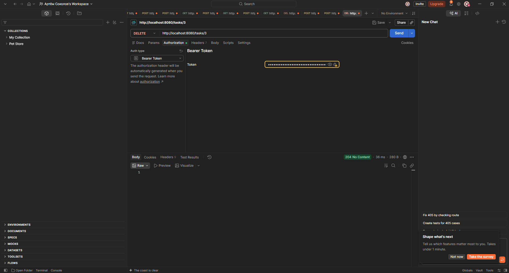
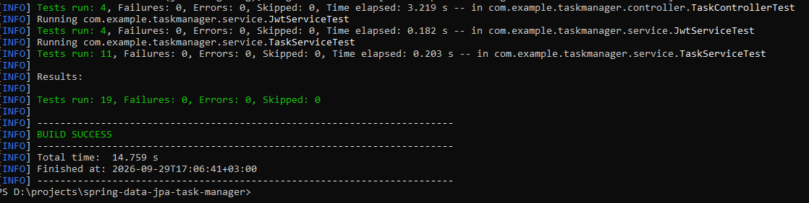
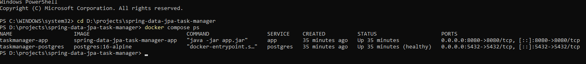
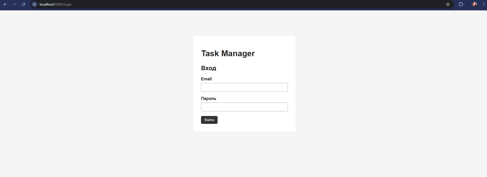
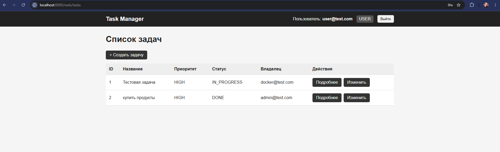
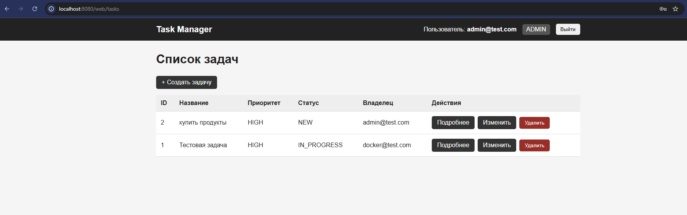
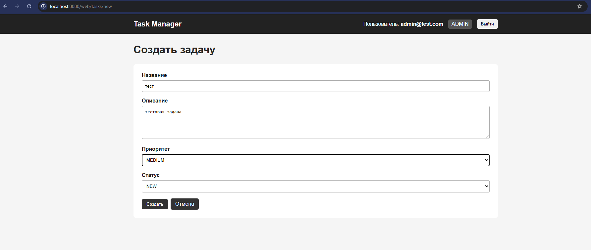

# Task Manager

В рамках проекта были выполнены следующие кт:

1. Spring Data JPA
2. JUnit + Mockito
3. Spring Security + JWT
4. Docker
5. Thymeleaf + Spring Security

---

# КТ Spring Data JPA Task Manager

## Цель работы

Основной задачей этой КТ был переход от хранения задач в памяти к работе с базой данных через Spring Data JPA.

Вместо `InMemoryTaskRepository` был создан репозиторий на основе `JpaRepository`.

Архитектура приложения:

Controller
    |
Service
    |
Repository
    |
Database

## Модель Task

Задача представлена JPA-сущностью `Task`.

Основные поля:

- `id` — идентификатор;
- `title` — название;
- `description` — описание;
- `priority` — приоритет;
- `status` — статус;
- `owner` — владелец задачи.

Приоритет задачи:

LOW
MEDIUM
HIGH

Статус задачи:

NEW
IN_PROGRESS
DONE

## Spring Data JPA

Для доступа к данным используется `TaskRepository`.

Spring Data JPA позволяет выполнять основные операции с базой без написания большого количества SQL вручную.

В проекте реализованы:

- создание задачи;
- получение задач;
- поиск задачи по ID;
- редактирование;
- удаление;
- изменение статуса;
- фильтрация;
- поиск;
- статистика;
- сортировка;
- пагинация.

## Проверка через Postman

REST API можно проверить через Postman.

Пример получения списка задач:

GET /tasks

Для защищённых запросов используется Bearer Token.

На скриншоте видно успешный ответ:

200 OK

И список задач, полученный через REST API.

---

# КТ Spring Security + JWT

## Цель работы

В этой КТ в Task Manager была добавлена система аутентификации и авторизации.

Были реализованы:

- пользователи;
- роли;
- регистрация;
- вход;
- BCrypt;
- JWT;
- JwtAuthFilter;
- разграничение доступа;
- обработка 401 и 403;
- security-тесты.

---

## Пользователи

В проект была добавлена сущность `User`.

Пользователь содержит:

id
email
password
role

Используются две роли:

USER
ADMIN

Пароли хранятся в зашифрованном виде с использованием:

BCryptPasswordEncoder

---

## Авторизация

Для входа используется:

POST /auth/login

Пример запроса:

{
  "email": "admin@test.com",
  "password": "admin123"
}

После успешной авторизации сервер возвращает JWT.

Полученный токен используется для обращения к защищённым REST endpoints:

Authorization: Bearer <token>

---

## JWT

Для работы с JWT создан `JwtService`.

Он выполняет:

- генерацию JWT;
- получение username из токена;
- проверку срока действия;
- проверку валидности токена.

Также используется `JwtAuthFilter`.

Общая схема:

HTTP Request
      |
JwtAuthFilter
      |
Bearer Token
      |
JwtService
      |
UserDetailsService
      |
SecurityContext
      |
Controller

Если JWT корректный, пользователь становится авторизованным для текущего запроса.

---

## Разграничение доступа

Для ограничения доступа используется Spring Security и `@PreAuthorize`.

Например, удаление задачи разрешено только пользователю с ролью ADMIN:

@PreAuthorize("hasRole('ADMIN')")

### Проверка USER

Пользователь с ролью USER пытается удалить задачу:

DELETE /tasks/2

Сервер возвращает:

403 Forbidden

Это означает, что пользователь авторизован, но у него недостаточно прав для выполнения операции.

### Проверка ADMIN

При выполнении DELETE-запроса пользователем ADMIN сервер разрешает операцию:

204 No Content

Таким образом, разграничение доступа по ролям работает.

---

## Тестирование

В проекте используются:

- JUnit;
- Mockito;
- MockMvc;
- Spring Security Test.

Для запуска тестов:

mvn clean test

Результат:

Tests run: 19
Failures: 0
Errors: 0
Skipped: 0

BUILD SUCCESS

Всего выполняется 19 тестов:

TaskControllerTest — 4
JwtServiceTest      — 4
TaskServiceTest     — 11

Все тесты проходят успешно.

---

# КТ Docker 

## Цель работы

В этой КТ приложение было контейнеризировано с помощью Docker.

При запуске через Docker вместо H2 используется PostgreSQL.

Docker Compose запускает два сервиса:
Spring Boo
PostgreSQL 16

---

## Dockerfile

Для сборки используется multi-stage Dockerfile.

### Первый этап — сборка

Используется Maven:

FROM maven:3.9-eclipse-temurin-21 AS builder

На этом этапе:

1. загружаются Maven-зависимости;
2. копируется исходный код;
3. выполняется сборка;
4. создаётся JAR.

Команда сборки:

mvn package -DskipTests

### Второй этап — запуск

Для запуска используется JRE:

FROM eclipse-temurin:21-jre-jammy

Готовый JAR копируется из первого этапа:

COPY --from=builder /build/target/*.jar app.jar

После чего приложение запускается:

ENTRYPOINT ["java", "-jar", "app.jar"]

---

## Non-root пользователь

Приложение внутри Docker-контейнера запускается не от root.

Для этого создаётся отдельный пользователь:

appuser

И используется:

USER appuser

---

## Docker Compose

В `docker-compose.yml` описаны два сервиса:

app
postgres

Для PostgreSQL используется:

postgres:16-alpine

Приложение доступно на:

http://localhost:8080

PostgreSQL:

localhost:5432

---

## Healthcheck

Для PostgreSQL настроен healthcheck через:

pg_isready

Приложение зависит от состояния PostgreSQL:

depends_on:
  postgres:
    condition: service_healthy

Это означает, что приложение запускается после того, как PostgreSQL готов принимать подключения.

Проверить контейнеры можно командой:

docker compose ps

На скриншоте видно:

taskmanager-app       Up
taskmanager-postgres  Up (healthy)

Следовательно, оба контейнера работают, а PostgreSQL успешно проходит healthcheck.

---

## PostgreSQL

В Docker-окружении Task Manager использует PostgreSQL.

Для Docker создан отдельный Spring-профиль:

docker

Конфигурация находится в:

src/main/resources/application-docker.properties

В Docker Compose устанавливается:

SPRING_PROFILES_ACTIVE=docker

Контейнер приложения подключается к базе по имени сервиса:

postgres

То есть внутри Docker используется адрес вида:

jdbc:postgresql://postgres:5432/taskdb

---

## Переменные окружения

Настройки базы и JWT вынесены в `.env`.

Пример:

POSTGRES_DB=taskdb
POSTGRES_USER=postgres
POSTGRES_PASSWORD=your_password

JWT_SECRET=your_secret
JWT_EXPIRATION=86400000

Настоящий `.env` не должен попадать в Git.

Он добавлен в:

.gitignore

Для примера используется:

.env.example

В нём находятся только примеры переменных без реальных секретов.

---

## Docker Volume

Для хранения PostgreSQL используется именованный Docker Volume:

postgres_data

Благодаря этому данные базы не удаляются вместе с контейнером.

Это было проверено следующим способом:

docker compose down
docker compose up

После повторного запуска ранее созданные пользователи и задачи остались в базе.

Если выполнить:

docker compose down -v

Volume будет удалён вместе с данными.

---

# КТ Thymeleaf + Spring Security

## Цель работы

В последней КТ к Task Manager был добавлен полноценный веб-интерфейс.

До этого основная работа с API выполнялась через Postman.

Теперь приложением можно пользоваться через браузер.

---

## Страница входа

Для браузерной версии используется Spring Security Form Login.

Страница авторизации:

http://localhost:8080/login

После успешной авторизации пользователь перенаправляется на:

/web/tasks

---

## TaskWebController

Для веб-интерфейса используется отдельный:

@Controller
TaskWebController

Он отвечает за:

- список задач;
- просмотр задачи;
- создание задачи;
- редактирование задачи;
- удаление задачи.

REST Controller и Web Controller выполняют разные задачи.

REST Controller возвращает данные, например JSON.

Web Controller передаёт данные в Thymeleaf и возвращает HTML-страницы.

---

## Thymeleaf

Для HTML-интерфейса используются Thymeleaf-шаблоны.

Основные шаблоны:
login.html
list.html
detail.html
form.html

Для работы с HTML используются конструкции Thymeleaf:

th:text
th:each
th:if
th:field
th:action

Общая схема:

Browser
   |
TaskWebController
   |
TaskService
   |
Model
   |
Thymeleaf
   |
HTML

---

## Интерфейс USER

После входа пользователя с ролью USER отображается список задач.

USER может:

- просматривать список задач;
- открывать подробную информацию;
- создавать задачи.
- изменять задачи.

Административные кнопки изменения и удаления для USER не отображаются.

---

## Интерфейс ADMIN

У ADMIN интерфейс отличается.

ADMIN видит дополнительные действия:

Подробнее
Изменить
Удалить

Для ограничения отображения элементов интерфейса используется интеграция Thymeleaf со Spring Security.

Например:

sec:authorize="hasRole('ADMIN')"

При этом безопасность реализована не только скрытием кнопок.

Доступ также проверяется на стороне сервера через Spring Security.

---

## Создание задачи

Через веб-интерфейс можно открыть форму создания новой задачи.

Форма позволяет указать:

- название;
- описание;
- приоритет;
- статус.

После отправки формы задача сохраняется через `TaskService` в базу данных.

---

# Запуск проекта через Docker

Для запуска необходим Docker Desktop.

Перейти в папку проекта:

cd D:\projects\spring-data-jpa-task-manager

Запустить приложение:

docker compose up --build

После запуска открыть:

http://localhost:8080/login

Остановить контейнеры:

docker compose down

Для последующего запуска без пересборки:

docker compose up

# Запуск тестов

Проект использует Java 17 для запуска тестов.

Проверить текущую версию:

mvn -version

Запустить тесты:

mvn clean test

Результат:

Tests run: 19, Failures: 0, Errors: 0, Skipped: 0

BUILD SUCCESS

---

# Итог

В рамках контрольных работ Task Manager постепенно дорабатывался:

Spring Data JPA
       |
 JUnit + Mockito
       |
Spring Security + JWT
       |
Docker + PostgreSQL
       |
Thymeleaf + Spring Security

В итоговой версии реализованы:

- Spring Data JPA;
- хранение задач в базе данных;
- REST API;
- пользователи;
- роли USER и ADMIN;
- BCrypt;
- JWT-аутентификация;
- JwtAuthFilter;
- разграничение доступа;
- обработка 401/403;
- автоматические тесты;
- Docker;
- Docker Compose;
- PostgreSQL;
- healthcheck;
- Docker Volume;
- переменные окружения;
- Spring-профиль для Docker;
- Thymeleaf;
- форма авторизации;
- веб-интерфейс;
- создание, просмотр, изменение и удаление задач.

Таким образом, итоговый проект можно использовать как через REST API, так и через браузерный веб-интерфейс.
