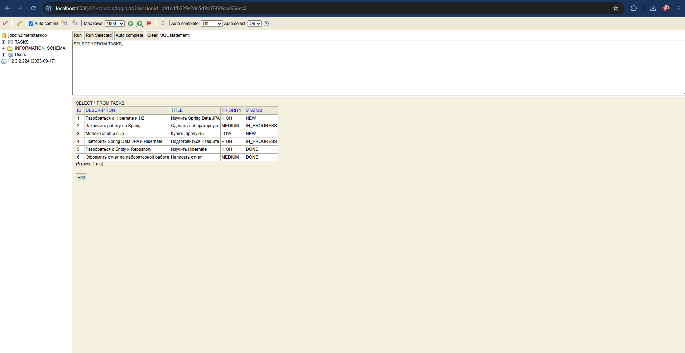

# Task Manager

Task Manager — приложение на Spring Boot для управления задачами.

## Используемые технологии

- Java
- Spring Boot
- Spring Web
- Spring Data JPA
- Spring Security
- JWT
- Hibernate
- H2
- PostgreSQL
- Thymeleaf
- Docker
- JUnit
- Mockito

## Структура приложения

Приложение построено по слоистой архитектуре:

Controller → Service → Repository → Database

- Controller принимает HTTP-запросы.
- Service содержит основную логику приложения.
- Repository отвечает за работу с базой данных.
- Entity описывает объекты, которые хранятся в базе.

## Работа с задачами

Для задач реализованы основные CRUD-операции:

- создание задачи;
- получение задач;
- изменение задачи;
- удаление задачи;
- изменение статуса;
- фильтрация и поиск.

Задача содержит название, описание, приоритет, статус и владельца.

## База данных

Для локального запуска используется H2.

Для запуска приложения через Docker используется PostgreSQL.

Для работы с базой данных используется Spring Data JPA и Hibernate.

## Spring Security и JWT

В приложении используется Spring Security.

Пользователи имеют роли USER и ADMIN.  
Доступ к некоторым операциям зависит от роли пользователя.

Для REST API используется JWT-аутентификация.

После успешного входа пользователь получает JWT-токен, который используется в следующих запросах.

Пользователь без необходимых прав получает ответ 403 Forbidden.

## Веб-интерфейс

Веб-интерфейс реализован с помощью Thymeleaf.

Контроллер передаёт данные в Model, после чего Thymeleaf формирует HTML-страницу.

Для отображения элементов в зависимости от роли используется интеграция Thymeleaf со Spring Security.

## Docker

Приложение можно запускать вместе с PostgreSQL через Docker Compose.

Docker Compose запускает два основных контейнера:

- Spring Boot приложение;
- PostgreSQL.

Для хранения данных PostgreSQL используется Docker Volume.

## Тестирование

Для тестирования используются JUnit, Mockito и MockMvc.

Тестами проверяется работа сервисов, контроллеров и JWT.

Всего выполняется 19 тестов.

## Итог

В проекте реализованы:

- CRUD для задач;
- Spring Data JPA;
- работа с H2 и PostgreSQL;
- Spring Security;
- JWT-аутентификация;
- роли USER и ADMIN;
- веб-интерфейс на Thymeleaf;
- Docker;
- автоматические тесты.
- веб-интерфейс;
- создание, просмотр, изменение и удаление задач.

Таким образом, итоговый проект можно использовать как через REST API, так и через браузерный веб-интерфейс.
